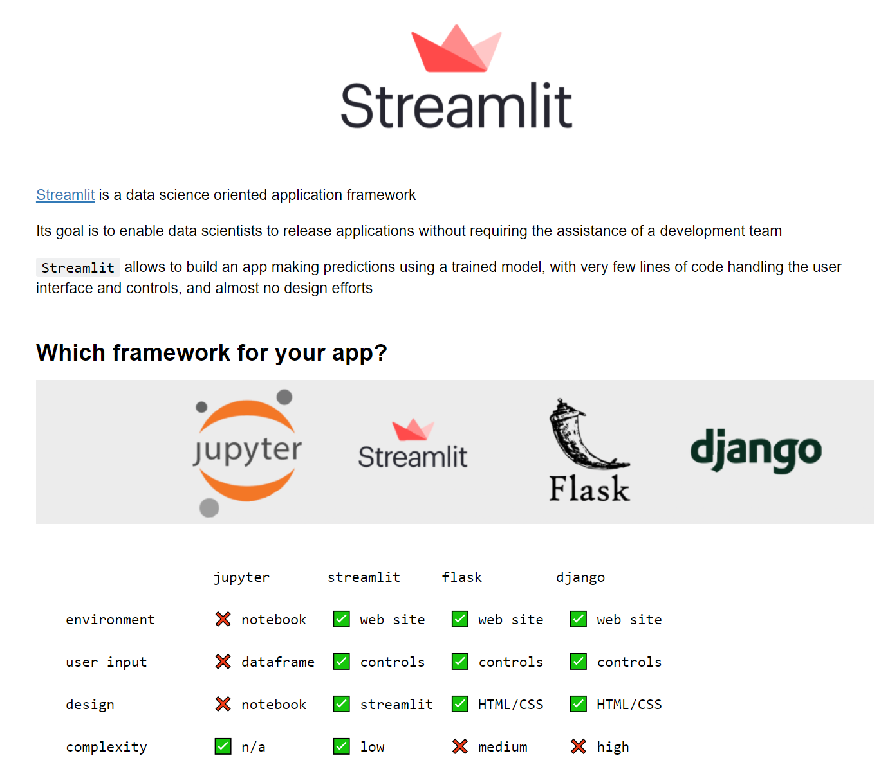
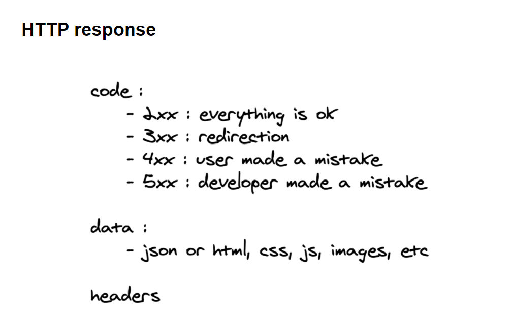

# Building a Machine Learning Web Application

## Bilibili videos
- Get Inspired!
- FastAPI
- Uvicorn
- Streamlit
- Prediction API use case
- Deployment on public cloud VM
- Deployment on Heroku
- Deployment on Github Pages
- Deployment on WeChat Mini-program

## Get Inspired!


- https://www.tensorflow.org/js
- https://streamlit.io/gallery
- https://maneprajakta.github.io/Digit_Recognition_Web_App/
- https://www.cs.ryerson.ca/~aharley/vis/fc/


## Streamlit



To learn how to use Streamlit, you are invited to watch those videos:  
- https://www.youtube.com/watch?v=R2nr1uZ8ffc
- https://www.youtube.com/watch?v=sxLNCDnqyFc
- https://www.youtube.com/watch?v=VtrFjkSGgKM
- https://www.youtube.com/watch?v=z8vgmvtgxCs

## FastAPI

- High performance python framework

- Easy to learn, fast to code

- Automatically generated documentation allowing to test the API endpoints easily.

```shell
pip install fastapi
```

##### Root entry point
**FastAPI** uses python decorators in order to link 
the routes that the developers will query to the 
code of the endpoints. The code of the decorated 
function will be called whenever an HTTP request 
is received. The response will be returned as a 
JSON object to the code querying the API.

```python
from fastapi import FastAPI

app = FastAPI()

# define a root `/` endpoint
@app.get("/")
def index():
    return {"ok": True}
```


##### What if we run the code?
```shell
python -m simple
```
Nothing happens...

We need to use a web server in order to listen to 
the web requests for the API and call the code of 
the corresponding endpoint !

We will use Uvicorn!

## Uvicorn




**Unicorn** (https://www.uvicorn.org/) is a lightning fast web server for python.

**Uvicorn** listens to all the HTTP requests and calls 
the code decorated for the corresponding **FastAPI**
endpoints.

```shell
pip install uvicorn
```

##### Let's run our API using the web server
**Uvicorn** requires as parameters the name of the python 
file to run (here simple.py) as well as the name of 
the variable inside of the file containing the 
instance of the FastAPI app (here the variable 
is called app, hence the supplied parameter simple:app).

```shell
uvicorn simple:app --reload
```

Now we can browse to the root page of the 
API: http://localhost:8000/

## Prediction API use case

##### Documentation and tests
FastAPI provides automatically
generated documentation allowing
developers to simplify their integration
of the API. The endpoints of the API
can be easily
tested through dedicated pages.

Swagger documentation and tests:
- http://localhost:8000/docs

Redoc documentation:
- http://localhost:8000/redoc

The /docs endpoint is powered by
[Swagger](https://github.com/swagger-api/swagger-ui)
nd comes in very handy in order to test our API and verify that everything is working correctly. It is also
very useful for developers wanting to test our API


##### Ask for prediction
We want to build an API to ask for a prediction. 
For example, how long (in minutes) is the queue 
at the entry of the Louvre museum for a given 
week day and time. To do so, our API should be 
able to accept an HTTP request with params:

```javascript
url = 'http://localhost:8000/predict'
params = {
    'day_of_week': 0, # 0 for Sunday, 1 for Monday, ... 
    'time': '14:00'
}
response = requests.get(url, params=params)
response.json()
#=> {wait: 64}
```

The ```requests.get(url, params=params)``` results 
in the HTTP request:

```
http://localhost:8000/predict?day_of_week=0&time=14:00
```

in which ```?day_of_week=0&time=14:00``` is called a query string.


##### ```/predict``` endpoint
Let's add a ```/predict``` endpoint to our API
```python
@app.get("/predict")
def predict():
    return {'wait': 64}
```

##### Query parameters
What if you want to pass parameters to the endpoint?

FastAPI provides a 
[simple way](https://fastapi.tiangolo.com/tutorial/query-params/)
to do so. 
You just need need to define the 
parameters you want to pass as the 
function parameters.

```python
@app.get("/predict")
def predict(day_of_week, time):
    # compute `wait_prediction` from `day_of_week` and `time`
    return {'wait': wait_prediction}
```

Query parameters are all ```str``` so you will 
need to deal with their conversions 
into the suitable data types!

## Deployment on public cloud VM

##### Why?
We want to enable any developer writing
code on a remote machine connected to
the Internet to interact with our program.

Now that we are able to run our API
on our machine, how can we push it
to production ?


## Deployment on free web hosts [Optional]

#### Heroku 

##### Docker

#### Github Pages

##### Nice Page

#### WeChat Mini-program


