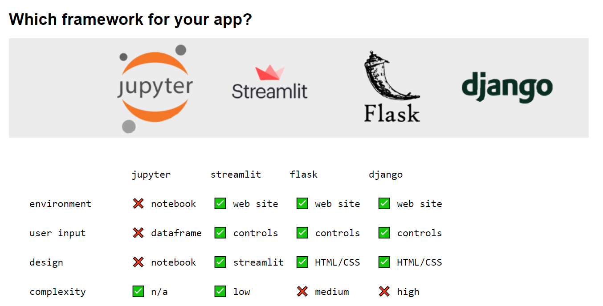

# Building a Machine Learning Web Application

## Bilibili videos
- Get Inspired! 
  - [Video](https://www.bilibili.com/video/BV1244y1J7C7/)
- Streamlit 
  - [Video 1 - Train model with Jupyter notebook](https://www.bilibili.com/video/BV1Ri4y117Qh/)
  - [Video 2 - Using trained model with streamlit](https://www.bilibili.com/video/BV1Ju411R7Gy/)
- Deployment on local machine
    - FastAPI
    - Uvicorn 
    - Python ```requests``` package
    - Prediction API use case
- Deployment on public cloud VM
- Deployment with Docker
- Deployment on free web hosts [Optional]
    - Deployment on Heroku [Optional]
    - Deployment on Github Pages [Optional]
    - Deployment on WeChat Mini-program [Optional]


## YouTube videos
- Streamlit
  - https://www.youtube.com/watch?v=R2nr1uZ8ffc
  - https://www.youtube.com/watch?v=sxLNCDnqyFc
  - https://www.youtube.com/watch?v=VtrFjkSGgKM
  - https://www.youtube.com/watch?v=z8vgmvtgxCs

- FastAPI
  - https://www.youtube.com/watch?v=kCggyi_7pHg

- Uvicorn
  - https://youtu.be/-ykeT6kk4bk?t=662

- Python ```requests``` package
  - https://www.youtube.com/watch?v=qriL9Qe8pJc
  


## Get Inspired!

- https://www.tensorflow.org/js
- https://streamlit.io/gallery
- https://playground.tensorflow.org
- https://maneprajakta.github.io/Digit_Recognition_Web_App/
- https://www.cs.ryerson.ca/~aharley/vis/fc/


## Streamlit


[Streamlit](https://www.streamlit.io/) is a 
data science oriented
application framework.

Its goal is to enable data 
scientists to release applications 
without requiring the assistance 
of a development team.

```Streamlit``` allows to build an 
app making predictions using 
a trained model, with very few 
lines of code handling the user 
interface and controls, and almost 
no design efforts.




#### How does it work?
Streamlit interprets the code of the app from top to bottom. Every elements encountered in the main script file are displayed in the interface one after the other

The elements may be simple variables (strings containing text or markdown), objects (dataframes are represented as tables), or more complex user controls (actions or inputs), charts, maps or third party graphs (matplotlib, plotly, etc)

Streamlit draws the output live in the browser, as a notebook would


#### API references
https://docs.streamlit.io/library/api-reference


#### A simple app
```python
import streamlit as st

import numpy as np
import pandas as pd

st.markdown("""# This is a header
## This is a sub header
This is text""")

df = pd.DataFrame({
          'first column': list(range(1, 11)),
          'second column': np.arange(10, 101, 10)
        })

# this slider allows the user to select a number of lines
# to display in the dataframe
# the selected value is returned by st.slider
line_count = st.slider('Select a line count', 1, 10, 3)

# and used in order to select the displayed lines
head_df = df.head(line_count)

head_df
```
#### Result


#### How to run the app?
```shell
streamlit run app.py
```

When the command is ran, Streamlit starts a web server and opens a new tab in the web browser showing the app. This allows you to assess the content of the page while you code.

```Streamlit``` automatically reloads the page as soon as the code of the main script file changes and is saved, which is very handy


## FastAPI


#### FastAPI
- High performance python framework

- Easy to learn, fast to code

- Automatically generated documentation allowing to test the API endpoints easily.

```shell
pip install fastapi
```

#### Root entry point
**FastAPI** uses python decorators in order to link 
the routes that the developers will query to the 
code of the endpoints. The code of the decorated 
function will be called whenever an HTTP request 
is received. The response will be returned as a 
JSON object to the code querying the API.

```python
from fastapi import FastAPI

app = FastAPI()

# define a root `/` endpoint
@app.get("/")
def index():
    return {"ok": True}
```


#### What if we run the code?
```shell
python -m simple
```
Nothing happens...

We need to use a web server in order to listen to 
the web requests for the API and call the code of 
the corresponding endpoint !

We will use Uvicorn!

## Uvicorn


**[Unicorn](https://www.uvicorn.org/)** is a lightning fast web server for python.

**Uvicorn** listens to all the HTTP requests and calls 
the code decorated for the corresponding **FastAPI**
endpoints.

```shell
pip install uvicorn
```

#### Let's run our API using the web server
**Uvicorn** requires as parameters the name of the python 
file to run (here simple.py) as well as the name of 
the variable inside of the file containing the 
instance of the FastAPI app (here the variable 
is called app, hence the supplied parameter simple:app).

```shell
uvicorn simple:app --reload
```

Now we can browse to the root page of the 
API: http://localhost:8000/

## Prediction API use case

#### HTTP request and response


#### Documentation and tests
FastAPI provides automatically
generated documentation allowing
developers to simplify their integration
of the API. The endpoints of the API
can be easily
tested through dedicated pages.

Swagger documentation and tests:
- http://localhost:8000/docs

Redoc documentation:
- http://localhost:8000/redoc

The /docs endpoint is powered by
[Swagger](https://github.com/swagger-api/swagger-ui)
and comes in very handy in order to test our API and verify that everything is working correctly. It is also
very useful for developers wanting to test our API


#### Ask for prediction with ```requests```
We want to build an API to ask for a prediction. 
For example, how long (in minutes) is the queue 
at the entry of the Louvre museum for a given 
week day and time. To do so, our API should be 
able to accept an HTTP request with params:

```python
url = 'http://localhost:8000/predict'
params = {
    'day_of_week': 0, # 0 for Sunday, 1 for Monday, ... 
    'time': '14:00'
}
response = requests.get(url, params=params)
response.json()
#=> {wait: 64}
```

The ```requests.get(url, params=params)``` results 
in the HTTP request:

```
http://localhost:8000/predict?day_of_week=0&time=14:00
```

in which ```?day_of_week=0&time=14:00``` is called a query string.


#### ```/predict``` endpoint
Let's add a ```/predict``` endpoint to our API
```python
@app.get("/predict")
def predict():
    return {'wait': 64}
```

#### Query parameters
What if you want to pass parameters to the endpoint?

FastAPI provides a 
[simple way](https://fastapi.tiangolo.com/tutorial/query-params/)
to do so. 
You just need need to define the 
parameters you want to pass as the 
function parameters.

```python
@app.get("/predict")
def predict(day_of_week, time):
    # compute `wait_prediction` from `day_of_week` and `time`
    return {'wait': wait_prediction}
```

Query parameters are all ```str``` so you will 
need to deal with their conversions 
into the suitable data types!

## Deployment on public cloud VM

#### Why?
We want to enable any developer writing
code on a remote machine connected to
the Internet to interact with our program.

Now that we are able to run our API
on our machine, how can we push it
to production ?

## Deployment with Docker


## Free (but more complicated) frontend alternatives for Streamlit [Optional]

### Heroku [Optional]

Do it with students if needed.

### Github Pages [Optional]

##### Nice Page

Do it with students if needed.


### WeChat Mini-program [Optional]

##### Take a photo and recognize digit

Do it with students if needed.


## Possible further extensions
- Plotly


## Misc

#### Debug Uvicorn & FastAPI from PyCharm
https://fastapi.tiangolo.com/tutorial/debugging/

##### Run Streamlit from PyCharm
https://discuss.streamlit.io/t/run-streamlit-from-pycharm/21624

Simply Change Interpreter options:
```shell
-m streamlit run
```
and then it's OK.

#### Debug Streamlit from PyCharm
- https://discuss.streamlit.io/t/version-1-5-0/21455/11
- https://stackoverflow.com/questions/60172282/how-to-run-debug-a-streamlit-application-from-an-ide

